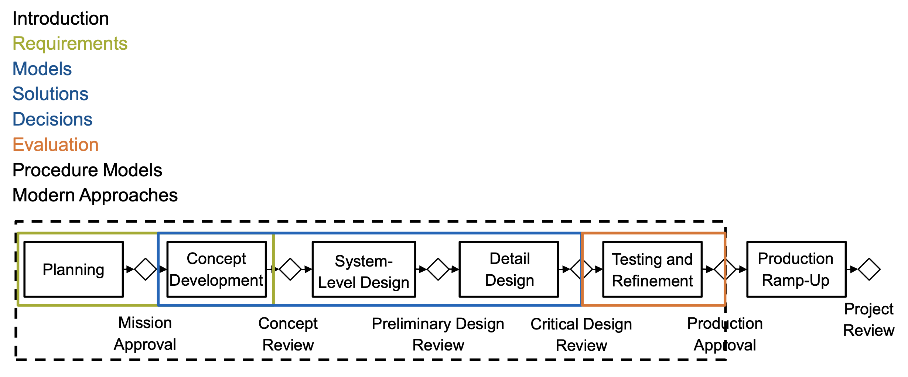

# Methods of Product Development

> Guidance for exam preparation.
> * Memorize all the terminologies (bold words/box paragraphs/fact sheets).
> * For non-calulational methods, memorize the steps, pros and cons, when and why to use them.
> * Around two big calculation questions, about 20 points in total. From chap requirements and chap solutions.
> * Only one answer is correct in multiple choice questions.
> * ~70 points for 60 mins. 15 terminology fillups + 20 direct calculation + 20 multiple choices + 15 calculation follow-ups.

## Introduction 3'

1. What is Product Development?
    
    * **Products**: designed artefacts by humans. 
    * MPD methods applicable to **all** products.
    * Design ends where making (in terms of production) starts.
    * A **design problem** is a design task with a more or less specified design goal.
    * A **solution** (to a design problem) or a **good design** is a design reaching its design goal.
    * The key challenges of designing are:
      * Understanding the problem
      * Asking the right questions
      * Providing answers
      * Finding a solution
2. Challenges in Product Development

   1. Market-related Challenges

        External influence, e.g Technology, Competition, Customers, Product, Politics, etc. All these can be **VUCA**.
        * Volatility = characterized by or subject to **rapid** or unexpected change.
        * Uncertainty = the state of being **not clearly** identified or defined.
        * Complexity = characterises the behavior of a system or model whose components interact in **multiple** ways and follow local rules, meaning there is no reasonable higher instruction to define the various possible interactions.
        * Ambiguity = the quality of being open to **more than one interpretation**; inexactness
   2. Designer-related Challenges
        * Many dependencies, variants
        * Counter-intuitive dependencies, nonlinearities
        * Solution Spaces within a Large Design Space
   3. Design-related Challenges

        * Humans as individuals: how to generate good ideas, limited intellectual capacity
        * Humans in groups: team dynamics
        * Groups of groups
    4. Combined challenges
        
        * Uncertainty
        * The dilemma of product development
1. III-designed Products
2. Design!
3. Keywords

## Requirements 19'

**Calculation** is required here.

1. What Product Should We Build?

    Assessing the Current Situation: Use the **SWOT** analysis. **Strengths** and **weaknesses** (internal factors), **Opportunities** and **threats** (external factors).
2. Design Goals and Requirements
3. Requirements Derived from Market Expectation

    **Benchmarking**.
    **QFD**.
4. How to Document Requirements
5. Requirements and Causality
6. How to Distribute Development Work?
7. **Quantitative Requirements**
8. Exercise
9.  Requirements - Summary
  
## Models 11'
1. Introduction
2. Function Models
3. Graphs and Matrices
4. Design Structure Matrices
5. Attribute Dependency Graphs (ADG)
6. Overview of Models

## Solutions 18'

**Calculation** is required here.

1. Challenges of Solution Generation
2. Creativity Techniques
3. Design Catalogues
4. Bio-inspired Design
5. Fundamentals of TRIZ Methods
6. Reverse Abstraction with Quantitative Models
7. Systematic Variation

## Decisions 5'
1. Pareto Optimality and Preferences
2. Ad-Hoc decisions
3. Basic Utility Evaluation
4. Extended Utility Evaluation
5. Overview & Summary

## Evaluation 5'
1. Overview
2. Prototyping
3. Failure Mode and Effects Analysis (FMEA)

## Procedure Models 5'
1. Introduction
2. Stage-Gate Models
3. V-Model
4. Solution Space Engineering
5. Munich Procedure Model
6. Iterative Models
7. Overview

## Modern Approaches 5'
1. Introduction
2. Modern Approach Philosophies
3. Methodologies and Tools
4. TMS
Summary